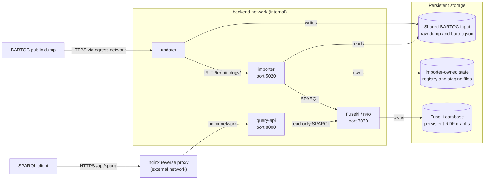

# BARTOC graph: Fuseki, importer, query API, and updater

Internal RDF store and terminology metadata importer for
[`coli-conc-server#72`](https://github.com/gbv/coli-conc-server/issues/72).
The stack combines:

- `ghcr.io/nfdi4objects/n4o-fuseki:main` as the RDF store;
- `ghcr.io/nfdi4objects/n4o-graph-importer:main` as the registry and importer;
- `ghcr.io/nfdi4objects/n4o-graph-apis:main` as the public query-only API;
- a local updater that registers a configurable subset of the BARTOC dump.

Fuseki and the importer remain on the internal network. Only the query API is
reachable through nginx.

## Architecture



All four services join `backend`. `query-api` additionally joins the external
`nginx` network, while `updater` joins `egress` to download the public dump.
Compose waits for Fuseki to become healthy before starting the importer and
query API, and for the importer to become healthy before starting the updater.

## Persistent storage

The three host-mounted storage areas have different owners and lifecycles:

| Directory | Owner | Purpose |
| --- | --- | --- |
| `data` | updater; read by importer | Unmodified BARTOC dump and normalized `bartoc.json`. |
| `stage` | importer | Persistent registry, per-item staging files, reports, and generated metadata. |
| `databases` and `logs` | Fuseki | TDB database, heap dumps, and rotating GC logs. |

The importer treats `stage` as application state, not as a disposable cache.
It reconstructs its registry from `stage/terminology/*.json`, not from Fuseki.
Without this volume, recreating the importer would leave the RDF store intact
but the importer would lose the information needed to list, retrieve, or purge
the registered items. The updater neither mounts nor manages `stage`.

## Services

| Service | Responsibility | Healthcheck |
| --- | --- | --- |
| `fuseki` | Stores the RDF named graphs in dataset `/n4o`. | Runs `ASK {}` against the internal SPARQL endpoint. |
| `importer` | Maintains the registry and stage, converts metadata to RDF, and writes to Fuseki. | Parses its local `/status.json` response. |
| `query-api` | Exposes read-only SPARQL queries through nginx. | Requests its local `/` page. |
| `updater` | Downloads and normalizes BARTOC metadata and starts the importer batch. | No healthcheck; `crond` remains in the foreground. |

The Fuseki check confirms that the query endpoint responds, including when the
database is empty. It does not verify imported records, triple counts, or
volume permissions. The importer check confirms only local HTTP and JSON
handling: in the current upstream image, the `connected` field is always
`true`. The query API check does not issue a SPARQL query. These checks are
service-local and do not provide end-to-end verification.

Compose starts the importer with:

```yaml
command: ["python", "./app.py", "--wsgi"]
```

The full command is required because Compose `command` replaces the image's
complete `CMD`. The `--wsgi` option selects Waitress instead of Flask's
development server.

## Public SPARQL API

The public endpoint is:

```text
https://bartoc.org/api/sparql
```

It forwards queries to `http://fuseki:3030/n4o` and supports GET and POST for
SELECT, ASK, CONSTRUCT, and DESCRIBE results. SPARQL Update requests and Graph
Store methods are rejected. Fuseki itself has no published host port. The API
allows cross-origin read access with `Access-Control-Allow-Origin: *`.

The corresponding BARTOC configuration for
[`bartoc.org#317`](https://github.com/gbv/bartoc.org/issues/317) is:

```json
{
  "sparql": "https://bartoc.org/api/sparql"
}
```

## Resource limits

| Service | Container limit | Additional settings |
| --- | --- | --- |
| `fuseki` | 3 GiB | JVM heap `256 MiB`–`2 GiB`; one-minute shutdown grace period. |
| `importer` | 768 MiB | No additional swap. |
| `query-api` | 512 MiB | No additional swap. |
| `updater` | 1 GiB | No additional swap. |

Each `memswap_limit` equals its `mem_limit`. Fuseki writes heap dumps and
rotating GC logs to its persistent `logs` directory.

## Scheduled and manual BARTOC update

The updater runs `/config/update.sh` every day at 06:00 UTC. Starting or
restarting its container does not trigger an immediate update.

It preserves the complete BARTOC dump, creates `/data/bartoc.json` from the
first `BARTOC_GRAPH_RECORD_LIMIT` records (`1000` by default), and sends them
to the importer. The updater writes only the shared `data` volume; the importer
owns its stage and updates Fuseki.

Concurrent runs are prevented by a lock. The importer batch is not
transactional, so rerun the updater after resolving a failed import.

Build, start, and inspect the scheduled updater:

```sh
srv raw bartoc-graph build updater
srv start bartoc-graph
srv raw bartoc-graph logs --follow updater
```

Run an additional update manually with:

```sh
srv run bartoc-graph --rm updater /config/update.sh
```

## Setup

Create the persistent directories and start the stack:

```sh
mkdir -p "$COLI_CONC_BASE/data/bartoc-graph"/{databases,logs,stage,data}
srv configtest bartoc-graph
srv raw bartoc-graph pull fuseki importer query-api
srv run bartoc-graph --rm --user root --entrypoint chown \
  fuseki -R 1000:1000 /fuseki/databases /fuseki/logs
srv start bartoc-graph
```

Preserve the `databases` and `stage` directories. `BARTOC_GRAPH_BASE` can
override the default graph base `https://bartoc.org/graph/`; keep its trailing
slash.
